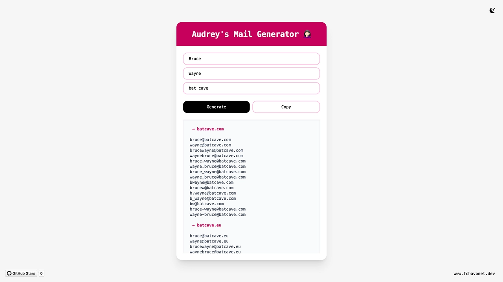

# Audrey's Mail Generator

## Description

Audrey's Mail Generator is a simple yet handy tool designed to help anyone guess or generate potential email addresses based on a person's first name, last name, and company name.

Originally built to help my campus manager at Holberton School, who frequently contacts professionals for talks, networking, or partnership opportunities, this tool automates a task she used to do manually: trying different email combinations in the hopes of finding the right one.

Beyond this specific use case, it can also serve as inspiration for those looking to create a professional email address for their own future company.

It’s a small tool with a big impact, and a nice opportunity to reinforce my JavaScript skills and DOM manipulation in a real-world context.

## Objectives

- Generate a variety of plausible email addresses from basic inputs.
- Save time and increase outreach efficiency by reducing guesswork.
- Use this as a practical exercise to improve JavaScript and DOM manipulation skills.
- Provide a clean, responsive, and user-friendly interface using Tailwind CSS.
- Explore text parsing, string combination logic, and clipboard APIs.

## Tech Stack


## File Description

| **FILE**     | **DESCRIPTION**                                     |
| :----------: | --------------------------------------------------- |
| `assets`     | Contains the resources required for the repository. |
| `index.html` | Main HTML structure for the project.                |
| `script.js`  | Behavior script for interactivity.                  |
| `README.md`  | The README file you are currently reading 😉.       |

## Installation & Usage

### Installation

1. Clone this repository:
    - Open your preferred Terminal.
    - Navigate to the directory where you want to clone the repository.
    - Run the following command:

```
git clone https://github.com/fchavonet/creative_coding-audrey_s_mail_generator.git
```

2. Open the cloned repository.

### Usage

1. Open the `index.html` file in your web browser.

2. Enter a first name, last name, and company name into the form fields.

3. Click "Generate" to display a list of possible email combinations based on common naming patterns and domain structures.

You can also test the project online by clicking [here](https://fchavonet.github.io/creative_coding-audrey_s_mail_generator/).

<p align="center">
    <picture>
        <source media="(prefers-color-scheme: dark)" srcset="./assets/images/screenshots/desktop_page_screenshot-dark.webp">
        <source media="(prefers-color-scheme: light)" srcset="./assets/images/screenshots/desktop_page_screenshot-light.webp">
        
    </picture>
</p>

## What's Next?

- Collect user feedback and expand name/domain pattern coverage if needed.
- Potentially integrate a lightweight back-end to automatically detect valid email addresses by analyzing bounce-back responses.

## Thanks

- A special thanks to Audrey for constantly (and unintentionally) feeding my dev project backlog 😁.

## Author(s)

**Fabien CHAVONET**
- GitHub: [@fchavonet](https://github.com/fchavonet)
